## 无人值守安装ubuntu18.04

实现特性：

- 定制一个普通用户名和默认密码
- 定制安装OpenSSH Server
- 安装过程禁止自动联网更新软件包

### 软件环境

- Virtualbox
- Ubuntu18.04.4 Server
- 网卡：NAT、Host-Only
- 镜像：ubuntu-18.04.4-server-amd64.iso

### 实验步骤

#### 网络配置

添加并启用 Host-Only 网卡

- 命令行直接配置

```bash
# 查看网卡
ifconfig -a

# 启用第二块网卡
sudo ifconfig enp0s8 up

```

- 使用 `netplan` 进行配置

```bash
# 修改配置文件
vi /etc/netplan/01-netcfg.yaml
# 添加以下内容
enp0s8:
  dhcp4: yes
```

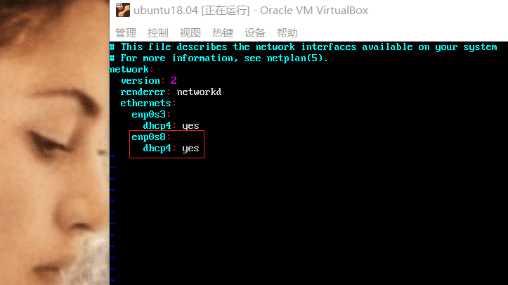

```bash
# 查看网卡信息
ifconfig | grep "enp0s8" -A 9
```

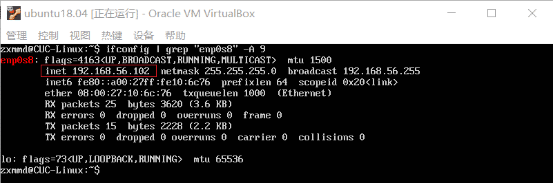

#### 远程连接配置

使用putty远程连接虚拟机

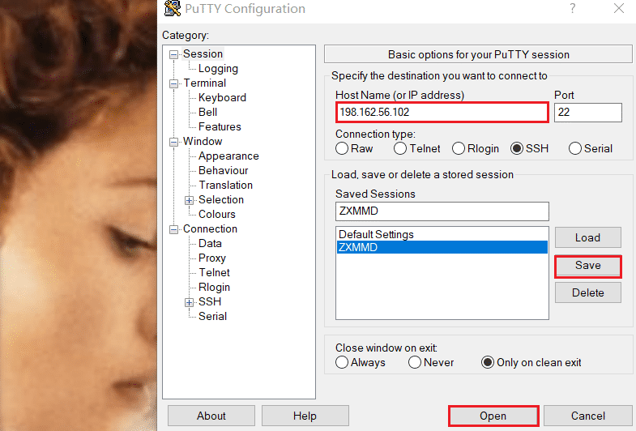

#### 定制镜像

先将镜像文件挂载到一个文件目录中，再对其中的配置文件进行修改

```bash
# 在当前用户目录下创建一个用于挂载iso镜像文件的目录
mkdir loopdir

# 上传本地iso镜像文件
# 使用PSFTP
put ubuntu-18.04.4-server-amd64.iso
```

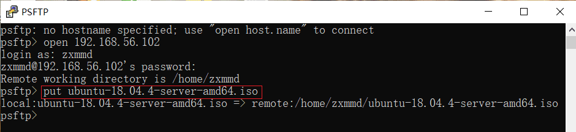

```bash
# 挂载iso镜像文件到该目录
# loopdir 挂载点
mount -o loop ubuntu-18.04.4-server-amd64.iso loopdir

# 创建一个工作目录用于克隆光盘内容
mkdir cd

# 同步光盘内容到目标工作目录
# 一定要注意loopdir后的这个/，cd后面不能有/
rsync -av loopdir/ cd

# 卸载iso镜像
umount loopdir

# 进入目标工作目录
cd cd/

# 编辑Ubuntu安装引导界面增加一个新菜单项入口
# 修改配置以识别 ubuntu-server-autoinstall.seed
vim isolinux/txt.cfg

# 在文件中添加以下内容
# 强制保存并退出 `:wq!`
label autoinstall
  menu label ^Auto Install Ubuntu Server
  kernel /install/vmlinuz
  append  file=/cdrom/preseed/ubuntu-server-autoinstall.seed debian-installer/locale=en_US console-setup/layoutcode=us keyboard-configuration/layoutcode=us console-setup/ask_detect=false localechooser/translation/warn-light=true localechooser/translation/warn-severe=true initrd=/install/initrd.gz root=/dev/ram rw quiet
```

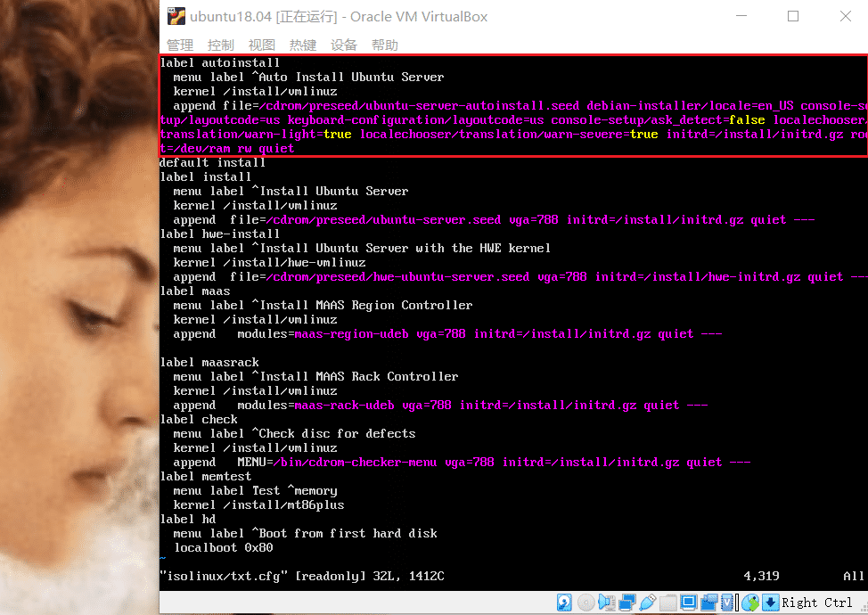

```bash
# 修改配置缩短超时等待时间
# timeout 10
vi isolinux/isolinux.cfg（可选，否则需要手动按下ENTER启动安装界面）
```

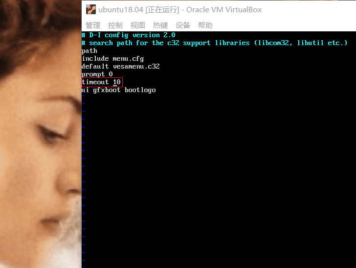

使用定制的预置文件，配置了安装时的默认选择

```bash
# 上传 ubuntu-server-autoinstall.seed
# 使用PSFTP
put ubuntu-server-autoinstall.seed
```

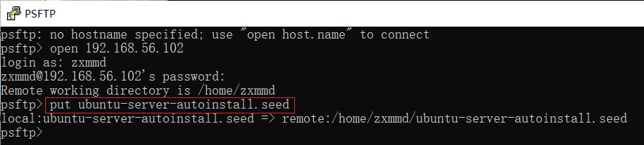

```bash
# 移动到指定目录下
mv ubuntu-server-autoinstall.seed ~/cd/preseed/

# 重新生成md5sum.txt
cd ~/cd
find . -type f -print0 | xargs -0 md5sum > md5sum.txt

# 无 mkisofs 命令
# 根据提示安装genisoimage
apt install genisoimage
```

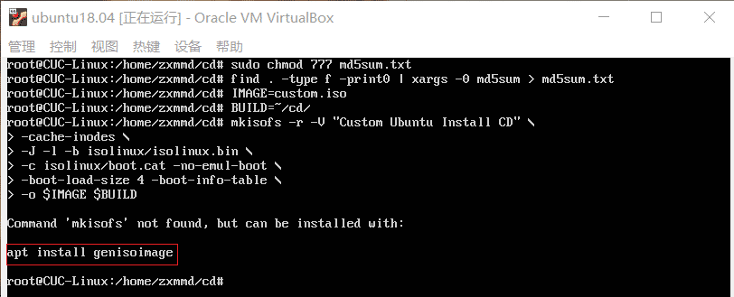

```bash
# 封闭改动后的目录到.iso
IMAGE=custom.iso
BUILD=~/cd/

mkisofs -r -V "Custom Ubuntu Install CD" \
            -cache-inodes \
            -J -l -b isolinux/isolinux.bin \
            -c isolinux/boot.cat -no-emul-boot \
            -boot-load-size 4 -boot-info-table \
            -o $IMAGE $BUILD
# 成功生成custom.iso
```

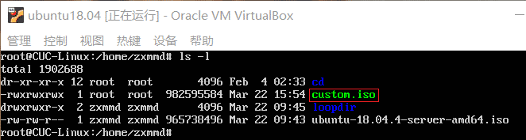

将生成的镜像文件拷贝到本地，用来进行自动化安装

```bash
# PSFTP
get custom.iso
#出现问题
# local: unable to open custom.iso
```

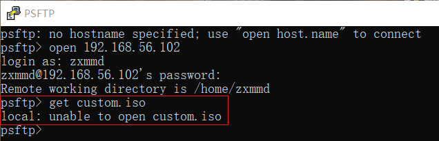

```bash
# 在使用chmod命令无效后，决定使用Git Bash将custom.iso拷贝到本地D盘
# Windows Git Bash
get /home/zxmmd/custom.iso D:/
```

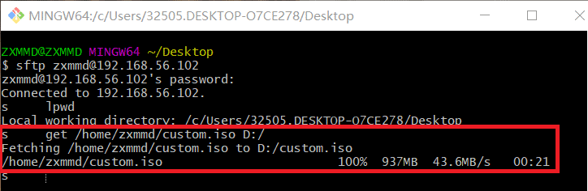

#### 实验结果

原先漫长的安装过程被压缩成了6minutes多，下图为无人值守安装过程


输入预先设置的用户名和密码即可进入系统

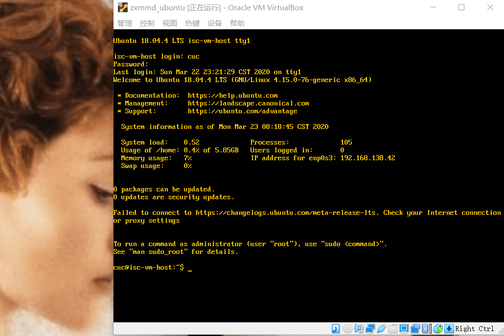

### 文件对比

使用 Beyond Compare
- 下载并安装后，将需要对比的两个文分别件拖入左、右窗口，将对比结果导出为 [diff.html](https://github.com/CUCCS/linux-2020-ZXMMD/blob/chap0x01/chap0x01/diff.html)

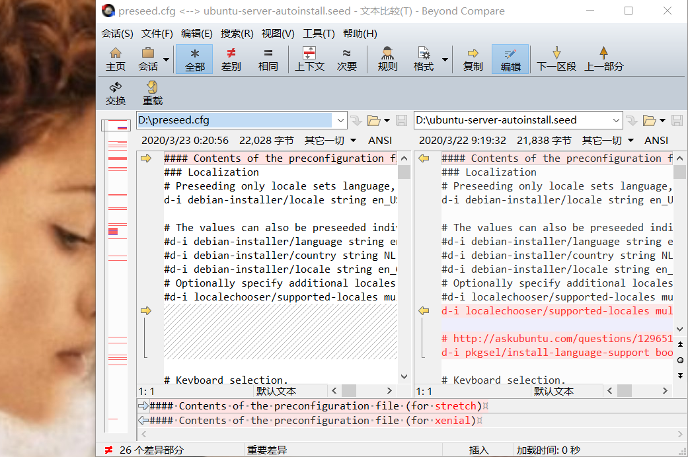

部分差异如下：

- 预置locale，指定支持的语言与地区的组合
  - 跳过选择语言支持软件包
- 不指定网卡
- 将链路检测超时时间缩减为5
- 将等待DHCP服务器超时时间缩减为5
- 手动配置网络
- 配置网络
- 配置主机名和域名
- 设置主机名 isc-vm-hos
- 创建普通用户
  - 设置名称
- 设置用户密码
  - 确认密码
- 设置时区为上海
- 在安装期间不使用NTP设置时
- 选择安装server软件包
- 安装openssh-server
- 禁止自动升级软件包
- update-policy：自动更新

### 参阅资料

- https://github.com/CUCCS/linux-2019-jckling

- https://blog.csdn.net/qq_31989521/article/details/58600426
