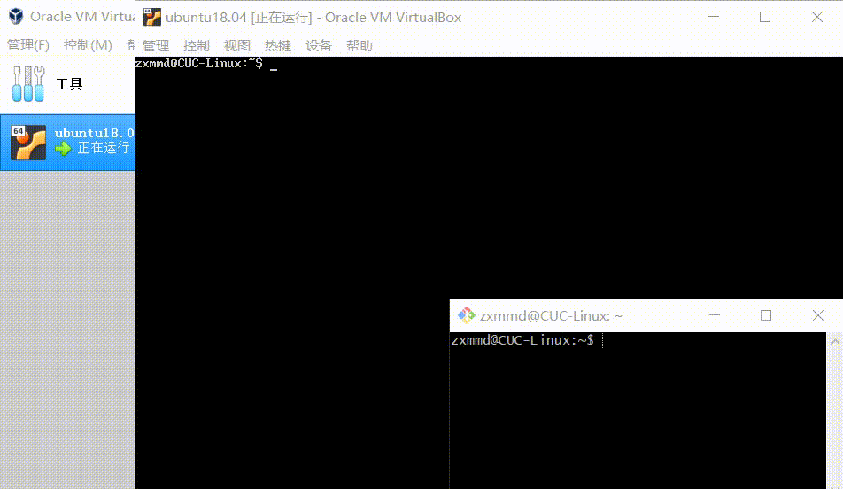
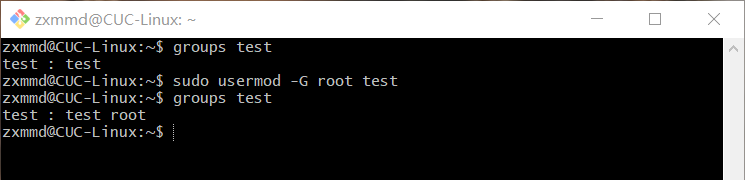
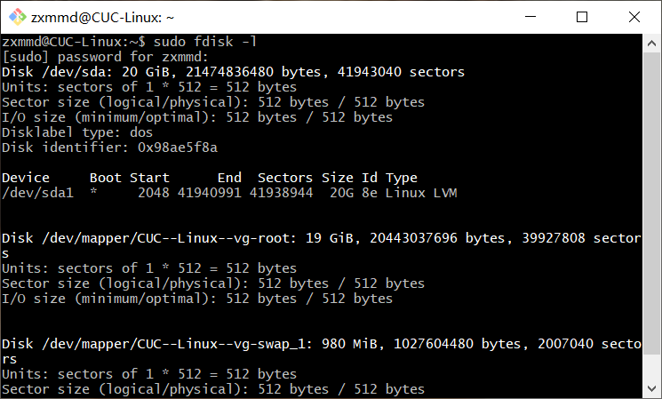
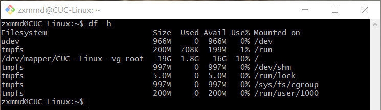
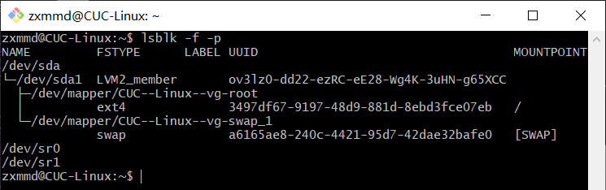
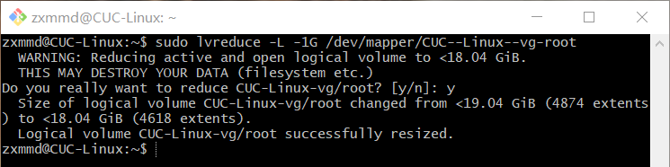
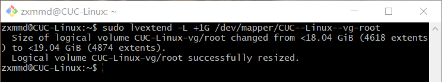
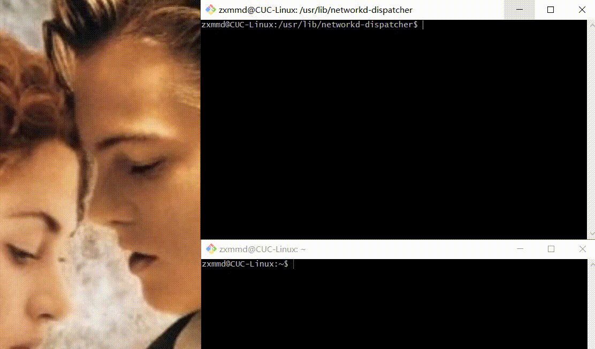
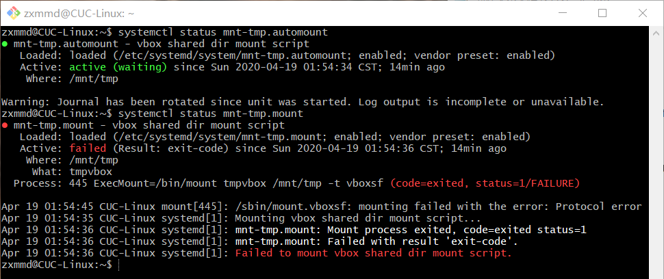
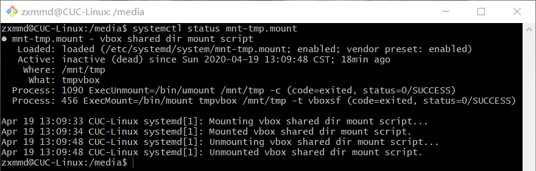

## Systemd 实验

### 实验要求

- 通过asciinema录像并上传

### 实验环境

- Ubuntu18.04 Server

- Git Bash

### systemd 操作录像

- 系统管理
    - 由于重启系统等操作无法通过asciinema录像上传，所以采用了分段录屏再合并又转成动图的方式



[](https://asciinema.org/a/320978)

- Unit

[](https://asciinema.org/a/321037)

- Unit 的配置文件

[](https://asciinema.org/a/321051)

- Target

[](https://asciinema.org/a/321052)

- 日志管理

[](https://asciinema.org/a/321068)

- 由于实战篇的内容在命令篇和自查清单中均有体现，所以未录像
### 自查清单

##### 1. 如何添加一个用户并使其具备sudo执行程序的权限？

```bash
# 添加普通用户test
sudo adduser test

# 切换到该用户
su test

# 无法执行sudo
sudo journalctl

# 切换到原用户
# 给test添加sudo权限
sudo vi /etc/sudoers
在   root ALL=(ALL:ALL) ALL 下面
添加 test ALL=(ALL:ALL) ALL

# 再切换到test,可以执行sudo
sudo journalctl
```

[](https://asciinema.org/a/321209)

##### 2. 如何将一个用户添加到一个用户组？

```bash
# 将test添加到root组
sudo usermod -G root test
```



##### 3. 如何查看当前系统的分区表和文件系统详细信息？
```bash
# 查看分区表
sudo fdisk -l
```


```bash
# 查看文件系统
df -h
```


```bash
# 同时查看分区表和文件系统的信息
lsblk -f -p
```


##### 4. 如何实现开机自动挂载Virtualbox的共享目录分区？

安装增强功能

```bash
sudo apt-get install virtualbox-guest-utils
```

创建挂载配置文件 `/etc/systemd/system/mnt-shared.mount`

```bash
# 创建 
sudo vi /etc/systemd/system/mnt-shared.mount

# 添加以下内容 
[Unit]
Description=vbox shared dir mount script
Requires=network-online.target
After=network-online.service

[Mount]
# window10下共享文件夹名称
What=myfiles

# linux中挂载目录，如果没有，需要创建
Where=/mnt/shared

# 指定挂载文件系统类型
Type=vboxsf

[Install]
WantedBy=multi-user.target
```
创建自动挂载配置文件 `/etc/systemd/system/mnt-shared.automount`

```bash
# 创建
sudo vi /etc/systemd/system/mnt-shared.automount

# 添加以下内容 
[Unit]
Description=vbox shared dir mount script
Requires=network-online.target
After=network-online.service

[Automount]
Where=/mnt/shared
TimeoutIdleSec=10

[Install]
WantedBy=multi-user.target
```

```bash
# 设置自动启动
sudo systemctl enable mnt-shared.mount
sudo systemctl enable mnt-shared.automount
 
# 重启即可自动挂载，可以看到新出现的myfiles
sudo reboot
```


##### 5. 基于LVM（逻辑分卷管理）的分区如何实现动态扩容和缩减容量？

```bash
# 查看逻辑卷信息
sudo lvdisplay
```
```bash
# 缩容 
sudo lvreduce -L -1G /dev/mapper/CUC--Linux--vg-root
```


```bash
# 扩容
sudo lvextend -L +1G /dev/mapper/CUC--Linux--vg-root
```


##### 6. 如何通过systemd设置实现在网络连通时运行一个指定脚本，在网络断开时运行另一个脚本？
使用networkd-dispatcher

编写脚本文件
```bash
# 编写dormant.d/demo.sh
#!/bin/bash
echo "$(date) $IFACE is dormant" >> /tmp/demo.log

# 编写no-carrier.d/demo.sh
#!/bin/bash
echo "$(date) $IFACE has no carrier" >> /tmp/demo.log

# 编写off.d/demo.sh
#!/bin/bash
echo "$(date) $IFACE is off" >> /tmp/demo.log

# 编写routable.d/demo.sh
#!/bin/bash
echo "$(date) $IFACE is routeable" >> /tmp/demo.log
```
给予可执行权限
```bash
sudo chmod +x filename
```
断开网络和连通网络
```bash
# 查看网络状况
networkctl status enp0s3

# 断开网络
sudo ip link set enp0s3 down

# 连通网络
sudo ip link set enp0s3 up
```



##### 7. 如何通过systemd设置实现一个脚本在任何情况下被杀死之后会立即重新启动？实现杀不死？

```bash
# 编辑配置文件
sudo vim /lib/systemd/system/apache2.service

# 将Restart字段设为always
Restart=always

# 重新载入
sudo systemctl daemon-reload

# 将Restart字段设为on-failure,表示任何意外的失败，就会重启，正常停止则不重启
# 更优雅
```


### 总结与反思

1.使用户具备sudo执行程序的权限
```bash
#可以把该用户test添加到sudo组中
sudo usermod -G sudo test

#使用在sudoers中添加 test ALL=(ALL:ALL) ALL的方法时，把用户test删除，
#再次创建名为test的用户时，test直接具备sudo执行权限，因为添加的test ALL=(ALL:ALL) ALL还在
```

2.论快照的重要性。
在实现开机自动挂载Virtualbox的共享目录分区时，由于不知道的原因，出现了一些错误。





在多次尝试以后没有解决问题，又担心已经修改过的配置文件影响后续操作，于是选择了重新安装ubuntu系统，这浪费了大量时间。

3.实现开机自动挂载共享文件夹，在设置的时候勾选自动挂载，会挂载到/media/目录下

4.慎重选择网上教程。
安装增强功能时，参考了[Ubuntu-server 18.04.2 LTS 安装VirtualBox增强功能](https://www.jianshu.com/p/45672da5e084)
但实际上并没有那么复杂，只需要`sudo apt-get install virtualbox-guest-utils`

5.动手操作的重要性。
在完成自查清单的过程中，在网络上和师哥师姐的作业中，一般能找到对应的命令操作，本来以为很简单，但是在实践的过程中总是会遇到问题，比如实现开机自动挂载共享文件夹，代码清清楚楚，但就是不断地出现问题。古人云：纸上得来终觉浅，绝知此事要躬行。还是有收获的。

### 参阅
- [实现开机自动挂载Virtualbox的共享目录分区](https://askubuntu.com/questions/252853/how-to-mount-a-virtualbox-shared-folder-at-startup)
- [老师给出的符合题意的解决方法](https://github.com/CUCCS/2015-linux-public-songyawen/pull/2)
- [通过systemd设置实现在网络连通时运行一个指定脚本，在网络断开时运行另一个脚本](https://asciinema.org/a/ND40x8WroOoDwjP2BWiR3ojLI)
- [Ubuntu-server 18.04.2 LTS 安装VirtualBox增强功能](https://www.jianshu.com/p/45672da5e084)
- [Systemd 入门教程：命令篇](http://www.ruanyifeng.com/blog/2016/03/systemd-tutorial-commands.html)
- [Systemd 入门教程：实战篇](http://www.ruanyifeng.com/blog/2016/03/systemd-tutorial-part-two.html)

