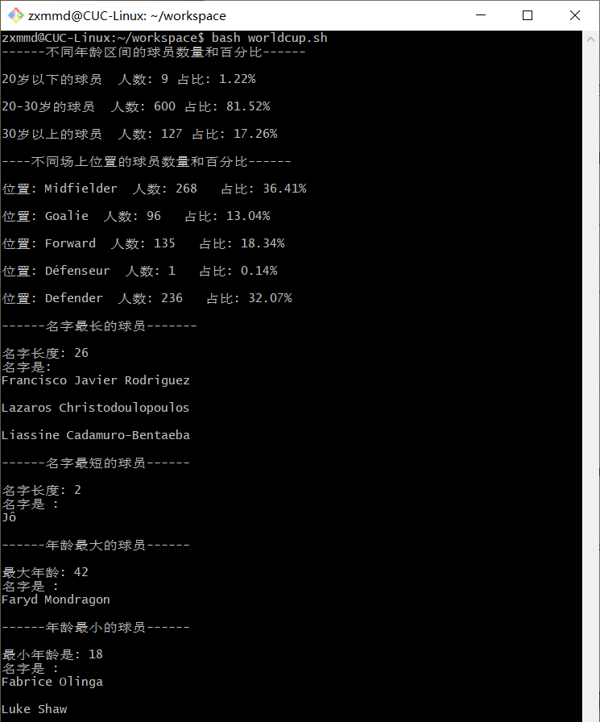

## shell脚本编程练习基础

### 实验要求

- 所有源代码文件必须单独提交并提供详细的脚本内置帮助信息
- 任务二的所有统计数据结果要求写入独立实验报告

### 实验环境

- 系统环境：Ubuntu 18.04
- PuTTY
- 安装 ImageMagick ：`sudo apt install imagemagick`

### 编程任务

#### 任务一：用bash编写一个图片批处理脚本，实现以下功能：
- [x] 支持命令行参数方式使用不同功能
- [x] 支持对指定目录下所有支持格式的图片文件进行批处理指定目录进行批处理
- [x] 支持以下常见图片批处理功能的单独使用或组合使用
  - 支持对jpeg格式图片进行图片质量压缩
  - 支持对jpeg/png/svg格式图片在保持原始宽高比的前提下压缩分辨率
  - 支持对图片批量添加自定义文本水印
  - 支持批量重命名（统一添加文件名前缀或后缀，不影响原始文件扩展名）
  - 支持将png/svg图片统一转换为jpg格式

#### 任务二：用bash编写一个文本批处理脚本，对以下附件分别进行批量处理完成相应的数据统计任务：

2014世界杯运动员数据

- [x] 统计不同年龄区间范围（20岁以下、[20-30]、30岁以上）的球员数量、百分比
- [x] 统计不同场上位置的球员数量、百分比
- [x] 名字最长的球员是谁？名字最短的球员是谁？
- [x] 年龄最大的球员是谁？年龄最小的球员是谁？

#### 任务三：用bash编写一个文本批处理脚本，对以下附件分别进行批量处理完成相应的数据统计任务：

Web服务器访问日志

- [x] 统计访问来源主机TOP 100和分别对应出现的总次数
- [x] 统计访问来源主机TOP 100 IP和分别对应出现的总次数
- [x] 统计最频繁被访问的URL TOP 100
- [x] 统计不同响应状态码的出现次数和对应百分比
- [x] 分别统计不同4XX状态码对应的TOP 10 URL和对应出现的总次数
- [x] 给定URL输出TOP 100访问来源主机

### 实验结果

#### 任务一

##### 待处理图片文件夹`images`和处理后图片文件夹`output`已上传

- 帮助信息

+ 对jpeg格式图片进行图片质量压缩

  `bash img.sh -d images -q 60`

- 对jpeg/png/svg格式图片在保持原始宽高比的前提下压缩分辨率

  `bash img.sh -d images -r 50%x50%`

- 对图片批量添加自定义文本水印

  `bash img.sh -d images -w "zxmmd"`

- 批量重命名（统一添加文件名前缀，不影响原始文件扩展名）

  `bash img.sh -d images --prefix "hi"`

- 将png/svg图片统一转换为jpg格式图片

  `bash img.sh -d images -c`
  
- 多参数混合使用，如将png/svg图片转换为jpg格式后添加水印
  `bash img.sh -d images -c -w "Linux"`

#### 任务二

##### 统计数据在`task2.md`中

- 测试语句

  `bash worldcup.sh`

#### 任务三

##### 统计数据在`web_log_data.txt`中

- 帮助信息

- 统计访问来源主机TOP 100和分别对应出现的总次数

  `bash web_log.sh -a`

- 统计访问来源主机TOP 100 IP和分别对应出现的总次数

  `bash web_log.sh -b`

- 统计最频繁被访问的URL TOP 100

  `bash web_log.sh -c`

- 统计不同响应状态码的出现次数和对应百分比

  `bash web_log.sh -d`

- 分别统计不同4XX状态码对应的TOP 10 URL和对应出现的总次数

  `bash web_log.sh -e`

- 给定URL输出TOP 100访问来源主机

  `bash web_log.sh -f "/ksc.html"`

### 参阅资料

- [https://github.com/CUCCS/linux-2019-jackcily/tree/job4/job4](https://github.com/CUCCS/linux-2019-jackcily/tree/job4/job4)
- [https://github.com/CUCCS/linux-2019-jckling/tree/master/0x04](https://github.com/CUCCS/linux-2019-jckling/tree/master/0x04)

- [Linux awk+uniq+sort 统计文件中某字符串出现次数并排序](https://www.cnblogs.com/wangbaihan/p/9262296.html)

