## Web服务器实验

### 实验环境

Ubuntu 18.04 Server
- NAT
- Host-Only：192.168.56.106


### 环境配置

#### 修改Windows主机上的host文件

```bash
# 找到host文件
C:\Windows\System32\drivers\etc\hosts

# 添加三条内容
192.168.56.106 wp.sec.cuc.edu.cn
192.168.56.106 dvwa.sec.cuc.edu.cn
192.168.56.106 verynginx.sec.cuc.edu.cn

```


```bash
# benchmarking tool
sudo apt-get install apache2-utils 
```
#### 安装 VeryNginx 

```bash
# 下载
cd ~/tmp
git clone https://github.com/alexazhou/VeryNginx.git

# 安装依赖
sudo apt-get update
sudo apt-get install libpcre3 libpcre3-dev libssl1.0-dev build-essential

# 安装
cd VeryNginx
sudo python install.py install

# 修改配置文件
sudo vim /opt/verynginx/openresty/nginx/conf/nginx.conf
        #将user从nginx修改为www-data
        #修改server监听端口为8080
        #保存退出

# 启动 
sudo /opt/verynginx/openresty/nginx/sbin/nginx

# 在浏览器中通过http://192.168.56.106:8080/verynginx/index.html访问
# 默认用户名和密码是 verynginx/verynginx
```
#### 安装 Nginx

- 直接安装，默认监听 80 端口

```bash
# 安装
sudo apt-get update
sudo apt-get install nginx

# 使用192.168.56.106:80访问
```

#### 安装 WordPress 4.7

- 下载mysql、php和相关扩展

```bash
# 安装数据库
sudo apt install mysql-server

#安装php和相关扩展
sudo apt install php-fpm php-mysql
sudo apt install php-curl php-gd php-intl php-mbstring php-soap php-xml php-xmlrpc php-zip

重新启动
sudo systemctl restart php7.2-fpm
```

- 新建数据库

```bash

sudo mysql -u root -p
> CREATE DATABASE wordpress DEFAULT CHARACTER SET utf8 COLLATE utf8_unicode_ci;
> GRANT ALL ON wordpress.* TO 'wpuser'@'localhost' IDENTIFIED BY 'test';
> FLUSH PRIVILEGES;
> EXIT;

```

- 下载wordpress

```bash

cd /tmp

# 下载实验指定版本
wget https://wordpress.org/wordpress-4.7.zip

# 解压
unzip wordpress-4.7.zip

# 移动文件夹到指定目录
cp /tmp/wordpress/wp-config-sample.php /tmp/wordpress/wp-config.php
sudo cp -a /tmp/wordpress/. /var/www/html/wordpress

# 修改文件夹属主
sudo chown -R www-data:www-data /var/www/html/wordpress
```

- 修改配置文件

```bash
curl -s https://api.wordpress.org/secret-key/1.1/salt/

sudo vim /var/www/html/wordpress/wp-config.php
        # 修改相关参数
        define('DB_NAME', 'wordpress');
        define('DB_USER', 'wpuser');
        define('DB_PASSWORD', 'test');
        # 添加
        define('FS_METHOD', 'direct');

sudo vim /etc/nginx/sites-available/default
        # 添加
        location ~ \.php$ {
            include snippets/fastcgi-php.conf;
            fastcgi_pass unix:/var/run/php/php7.2-fpm.sock;
            }
        # 修改网站根站点
        root /var/www/html/wordpress;
        # 修改监听端口
        listen 8888;
        # 修改server_name
        wp.sec.cuc.edu.cn
        # 添加
        index index.html index.htm index.php index.nginx-debian.html;

# 重启nginx
sudo systemctl restart nginx
```

#### 安装DVWA 

- 下载

```bash
cd /tmp
git clone https://github.com/ethicalhack3r/DVWA
sudo mv /tmp/DVWA /var/www/html
```

- 新建数据库

```bash
sudo mysql -u root -p

> CREATE DATABASE dvwa DEFAULT CHARACTER SET utf8mb4 COLLATE utf8mb4_unicode_ci;
> GRANT ALL ON dvwa.* TO 'dvwauser'@'localhost' IDENTIFIED BY 'test';
> FLUSH PRIVILEGES;
> EXIT;

sudo systemctl restart mysql
```

- 修改配置文件

```bash
cd /var/www/html/DVWA
cp config/config.inc.php.dist config/config.inc.php

sudo vim /var/www/html/DVWA/config/config.inc.php 
        # 修改以下内容
        _DVWA[ 'db_database' ] = 'dvwa';
        _DVWA[ 'db_user' ]     = 'dvwauser';
        _DVWA[ 'db_password' ] = 'test';

# 修改文件属主
sudo chown -R www-data:www-data /var/www/html/DVWA

# 修改 nginx 相关配置
sudo vim /etc/nginx/sites-available/default
        # 添加
        server {
            listen 5566;
            root /var/www/html/DVWA;
            server_name  dvwa.sec.cuc.edu.cn;
            index index.html index.htm index.php index.nginx-debian.html;

            location / {
                try_files $uri $uri/ = 404;
            }

            location ~ \.php$ {
                include snippets/fastcgi-php.conf;
                fastcgi_pass unix:/var/run/php/php7.2-fpm.sock;
            }
        }

# 重启nginx
sudo systemctl restart nginx

# 修改php.ini
sudo vim  /etc/php/7.2/fpm/php.ini
        # 设置
        allow_url_include = On

# 重启
systemctl restart php7.2-fpm
```


### 实验要求

#### 基本要求

- 在一台主机（虚拟机）上同时配置Nginx和VeryNginx
  - VeryNginx作为本次实验的Web App的反向代理服务器和WAF
  - PHP-FPM进程的反向代理配置在nginx服务器上，VeryNginx服务器不直接配置Web站点服务
- 使用Wordpress搭建的站点对外提供访问的地址为： http://wp.sec.cuc.edu.cn
- 使用Damn Vulnerable Web Application (DVWA)搭建的站点对外提供访问的地址为： http://dvwa.sec.cuc.edu.cn

##### 实现方式
- 修改Nginx配置文件，将原本wordpressd的`8888`端口修改为 `127.0.0.1:8888`，DVWA的 `5566` 端口修改为 `127.0.0.1:5566`
- 通过`VeryNginx`进行相关设置
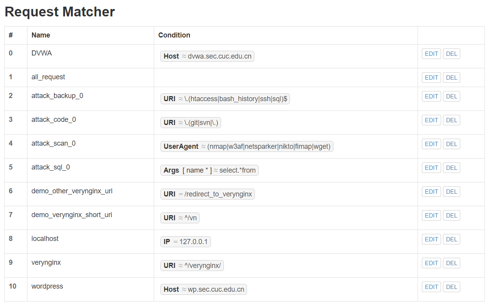
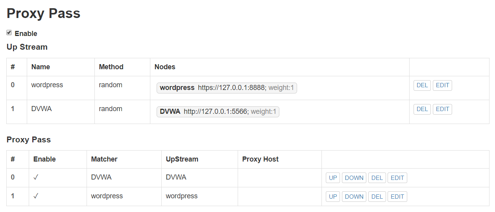

##### 实现效果
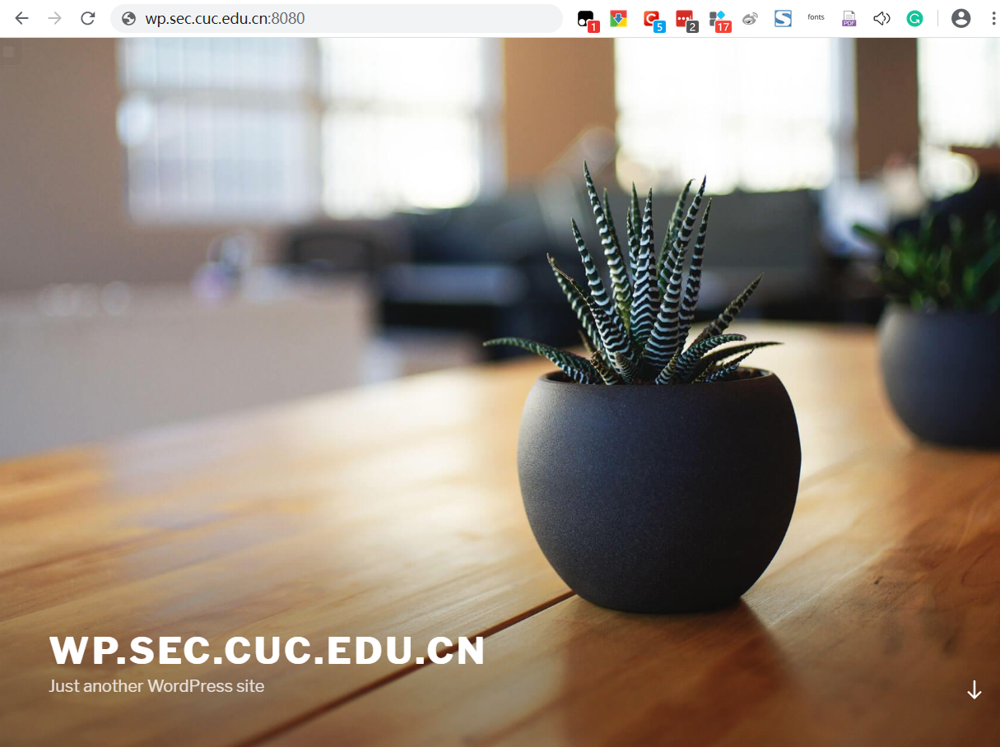
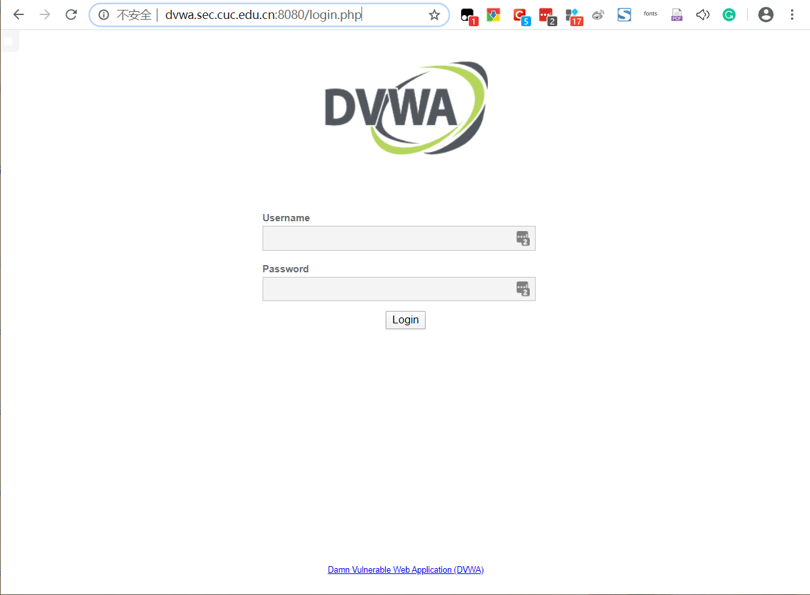

#### 安全加固要求

##### 使用IP地址方式均无法访问上述任意站点，并向访客展示自定义的友好错误提示信息页面

- 在verynginx管理界面配置以下规则
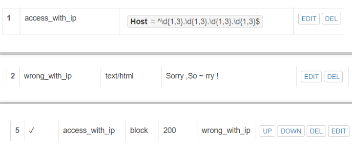
- 实现效果
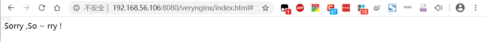

##### Damn Vulnerable Web Application (DVWA)只允许白名单上的访客来源IP，其他来源的IP访问均向访客展示自定义的友好错误提示信息页面

- 在verynginx管理界面配置以下规则
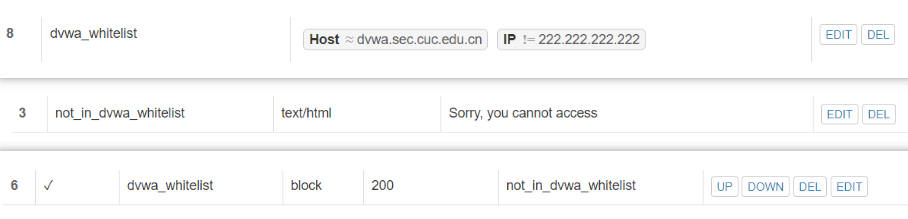
- 实现效果
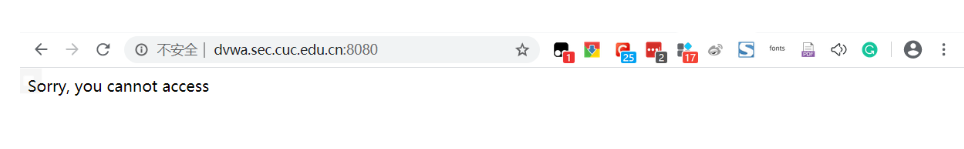

##### 在不升级Wordpress版本的情况下，通过定制VeryNginx的访问控制策略规则，热修复WordPress < 4.7.1 - Username Enumeration

- 在verynginx管理界面配置以下规则
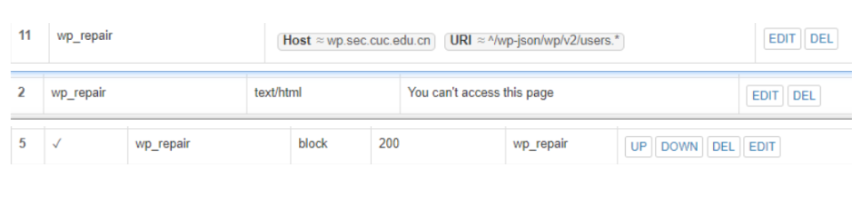


##### 通过配置VeryNginx的Filter规则实现对Damn Vulnerable Web Application (DVWA)的SQL注入实验在低安全等级条件下进行防护

- 在verynginx管理界面配置以下规则
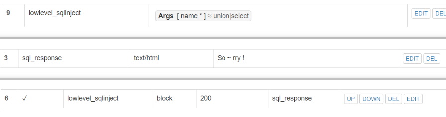
- 实现效果
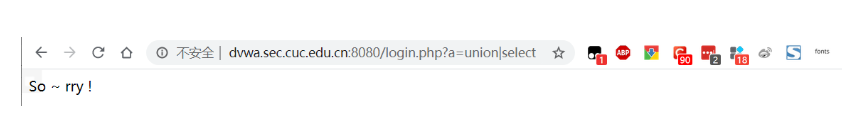


#### VERYNGINX配置要求

##### VeryNginx的Web管理页面仅允许白名单上的访客来源IP，其他来源的IP访问均向访客展示自定义的友好错误提示信息页面

- 在verynginx管理界面配置以下规则
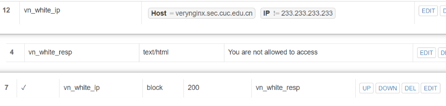
- 实现效果
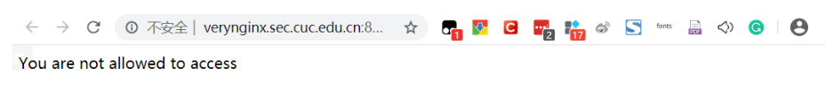

##### 通过定制VeryNginx的访问控制策略规则

- 限制DVWA站点的单IP访问速率为每秒请求数 < 50 && 限制Wordpress站点的单IP访问速率为每秒请求数 < 20

   - 在verynginx管理界面配置以下规则
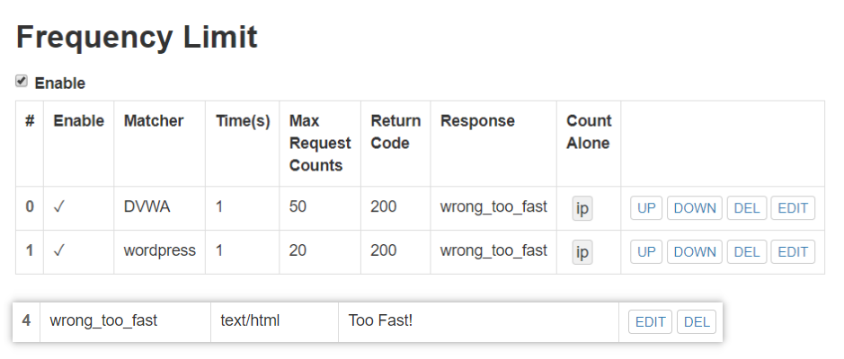
   - 实现效果
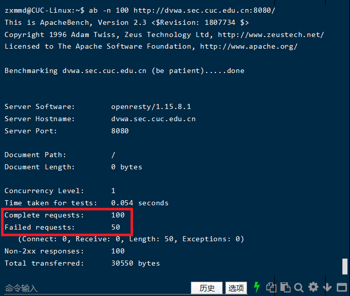


- 禁止curl访问

   - 在verynginx管理界面配置以下规则
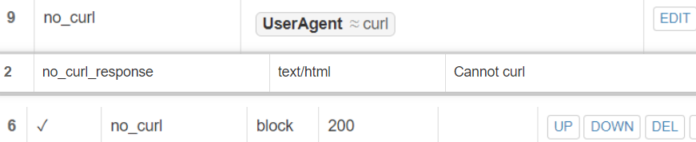
   - 实现效果
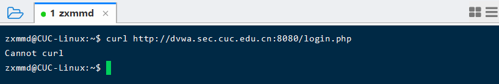


### 遇到的问题

- 限制DVWA和wordpress站点的单IP访问速率时，浏览器不显示错误提示信息。没有解决。

### 参考资料
- [How To Install WordPress with LEMP on Ubuntu 18.04](https://www.digitalocean.com/community/tutorials/how-to-install-wordpress-with-lemp-on-ubuntu-18-04)
- [ethicalhack3r/DVWA](https://github.com/ethicalhack3r/DVWA)
- [alexazhou/VeryNginx](https://github.com/alexazhou/VeryNginx)
- [Trouble Shooting](https://github.com/alexazhou/VeryNginx/wiki/Trouble-Shooting)
- [WordPress < 4.7.1 - Username Enumeration](https://www.exploit-db.com/exploits/41497)
- https://github.com/CUCCS/linux-2019-jackcily/blob/job5/job5/%E5%AE%9E%E9%AA%8C5.md