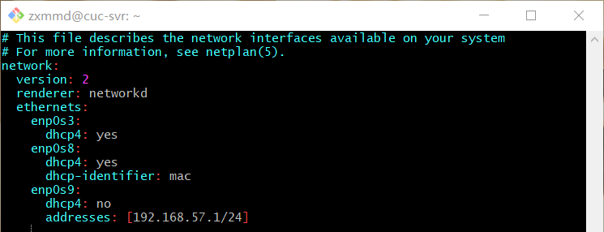
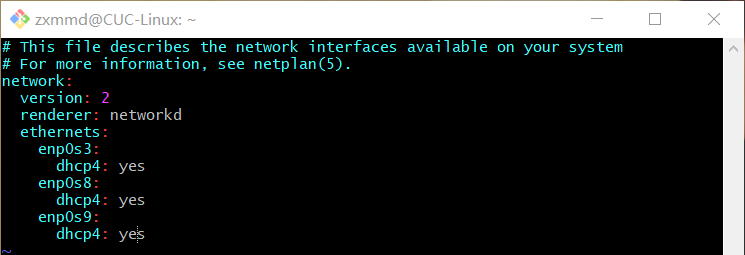

## Shell脚本编程进阶实验
 > FTP、NFS、DHCP、DNS、Samba服务器的自动安装与自动配置
### 实验环境

* ubuntu18.04 server 
   * 工作主机：zxmmd@CUC-Linux，IP：192.168.56.106
   * 目标主机：root@cuc-svr，IP：192.168.56.111

### 实验要求
   - [x] FTP
     * 对照第6章课件中的要求选择一款合适的FTP服务器软件支持所有任务要求
   - [x] NFS
     * 对照第6章课件中的NFS服务器配置任务
   - [x] DHCP
     * 2台虚拟机使用Internal网络模式连接，其中一台虚拟机上配置DHCP服务，另一台服务器作为DHCP客户端，从该DHCP服务器获取网络地址配置
   - [x] Samba
     * 对照第6章课件中smbclient一节的3点任务要求完成Samba服务器配置和客户端配置连接测试
   - [x] DNS
     * 基于上述Internal网络模式连接的虚拟机实验环境，在DHCP服务器上配置DNS服务，使得另一台作为DNS客户端的主机可以通过该DNS服务器进行DNS查询
    在DNS服务器上添加`zone "cuc.edu.cn"` 的以下解析记录

           ns.cuc.edu.cn NS
           ns A <自行填写DNS服务器的IP地址>
           wp.sec.cuc.edu.cn A <自行填写第5章实验中配置的WEB服务器的IP地址>
           dvwa.sec.cuc.edu.cn CNAME wp.sec.cuc.edu.cn

### 实验过程

#### 配置远程目标主机的SSH免密root登录

- 目标主机配置
```bash
# 开启ssh服务
sudo service ssh start

# 修改ssh配置文件
sudo vim /etc/ssh/sshd_config
    # 添加：
    # 设置可通过口令认证SSH
    PasswordAuthentication yes
    # 允许root用户登录
    PermitRootLogin yes

# 重启ssh服务
sudo systemctl restart ssh

# 给root用户设置密码
sudo passwd
```

- 工作主机生成秘钥
```bash
# 生成一对公私钥,foo为文件名
ssh-keygen -f foo

# 将公钥传输至目标主机
ssh-copy-id -i foo root@192.168.56.111
```

- 设置免密登录
```bash
# 修改目标主机配置文件
sudo vim /etc/ssh/sshd_config

    PasswordAuthentication no
    PermitRootLogin without-password

# 重启ssh服务
sudo systemctl restart ssh

# root免密登录
ssh -i foo root@192.168.56.111
```


#### FTP
- 脚本文件：[vsftpd.sh](scripts/vsftpd.sh)
- 配置文件：[/etc/vsftpd.conf](configs/vsftpd.conf)

- 配置一个提供匿名访问的FTP服务器，匿名访问者可以访问1个目录且仅拥有该目录及其所有子目录的只读访问权限


- 配置一个支持用户名和密码方式访问的账号，该账号继承匿名访问者所有权限，且拥有对另1个独立目录及其子目录完整读写（包括创建目录、修改文件、删除文件等）权限


- FTP用户不能越权访问指定目录之外的任意其他目录和文件


- 匿名访问权限仅限白名单IP来源用户访问，禁止白名单IP以外的访问


#### NFS
- 脚本文件
  - [nfs_srv.sh](scripts/nfs_srv.sh)
  - [nfs_clt.sh](scripts/nfs_clt.sh)
- 配置文件
  - [/etc/exports](configs/exports)

- 在1台Linux上配置NFS服务，另1台电脑上配置NFS客户端挂载2个权限不同的共享目录，分别对应只读访问和读写访问权限
  - 创建的两个目录分别为:只读`/nfs/gen_r`和读写`/nfs/gen_rw`
    
    
  - 两个共享文件目录对应只读和读写访问权限
    
  - 客户端共享目录中文件、子目录的属主、权限信息和在NFS服务器端的信息,uid和gid一致
    
    
- 添加两个/home下的共享目录，分别设置`no_root_squash`和不设置`no_root_squash`
  - 对于设置了no_root_squash的共享目录
    
  - 对于没有设置no_root_squash的共享目录，无法在工作主机(client)写入文件，创建目录
    

#### DHCP
- 脚本文件 [dhcp.sh](scripts/dhcp.sh)
- 配置文件 
  - [/etc/dhcp/dhcpd.conf](configs/dhcpd.conf)
  - [/etc/default/isc-dhcp-server](configs/isc-dhcp-server)

- 2台虚拟机使用Internal网络模式连接，其中一台虚拟机上配置DHCP服务，另一台服务器作为DHCP客户端，从该DHCP服务器获取网络地址配置
  - 先将两台虚拟机增加网卡为`内部网络`网络模式`
      
      

  - server配置
      * `/etc/netplan/01-netcfg.yaml`
        
  
  - client配置
      * `/etc/netplan/01-netcfg.yaml`
        
  - 实验结果
    
    

#### DNS
- 基于上述Internal网络模式连接的虚拟机实验环境，在DHCP服务器上配置DNS服务，使得另一台作为DNS客户端的主机可以通过该DNS服务器进行DNS查询
- 在DNS服务器上添加 zone "cuc.edu.cn" 的解析记录

- 配置文件：
  - [/etc/bind/named.conf.options](configs/named.conf.options)
  - [/etc/bind/named.conf.local](configs/named.conf.local)
  - [/etc/bind/db.cuc.edu.cn](configs/db.cuc.edu.cn)

- server配置
```bash
# 安装bind9
sudo apt install bind9
        
# 修改配置文件
sudo vim /etc/bind/named.conf.options
    # 在options选项中添加以下配置
        listen-on { 192.168.57.1; };  
        allow-transfer { none; }; 
        forwarders {
            8.8.8.8;
            8.8.4.4;
        };
      
# 编辑配置文件
sudo vim /etc/bind/named.conf.local
    #添加如下配置
        zone "cuc.edu.cn" {
            type master;
            file "/etc/bind/db.cuc.edu.cn";
        };
      
# 生成配置文件`db.cuc.edu.cn`
sudo cp /etc/bind/db.local /etc/bind/db.cuc.edu.cn
       
# 编辑配置文件
sudo vim /etc/bind/db.cuc.edu.cn
    # 添加
        ;@      IN      NS      localhost.
                IN      NS      ns.cuc.edu.cn.
        ns      IN      A       192.168.57.1
        wp.sec.cuc.edu.cn.      IN      A       192.168.57.1
        dvwa.sec.cuc.edu.cn.    IN      CNAME   wp.sec.cuc.edu.cn.
        @       IN      AAAA    ::1
       
# 重启bind9
sudo service bind9 restart
      
```
- client配置
```bash
# 安装resolvconf
sudo apt install resolvconf`

# 修改配置文件
sudo vim /etc/resolvconf/resolv.conf.d/head
    #添加配置
    search cuc.edu.cn
    nameserver 192.168.57.1
```
- 测试结果：


#### Samba

- 在windows 10客户端上连接Linux上的Samba服务器
  - 脚本文件[smb_srv.sh](scripts/smb_srv.sh)
  - 配置文件[/etc/samba/smb.conf](configs/smb.conf)
  - 在虚拟机上运行脚本
  - 打开资源管理器，右键“此电脑”，选择“添加一个网络位置”
  - 输入共享文件夹路径
   
   

  - 访问匿名目录，不用输入账号密码
   

  - 访问指定用户文件夹，需要输入账号密码
   

- 在Linux上连接Windows10上的服务器
  - 安装smbclient `sudo apt install smbclient`
  - 在windows 10上设置共享目录,参考[linux-public-JuliBeacon](https://github.com/CUCCS/2015-linux-public-JuliBeacon/blob/exp6/%E5%AE%9E%E9%AA%8C%206/%E5%9C%A8Linux%E5%92%8CWindows%E9%97%B4%E8%AE%BE%E7%BD%AE%E6%96%87%E4%BB%B6%E5%85%B1%E4%BA%AB.md)
  - Linux访问Windows的共享目录
   

  - 下载整个目录
   

### 说明
- 由于觉得多重加载方式配置虚拟机比较容易，就没有给目标主机做快照，导致使用的目标主机的IP地址换了几次。截图中出现的`192.168.56.110`和`192.168.56.111`均指目标主机
- 上次做完实验后直接恢复备份，这次居然用到了wordpress和dvwa......(只好重新配置)

### 参考资料
- [2015-linux-public-JuliBeacon](https://github.com/CUCCS/2015-linux-public-JuliBeacon/blob/exp6/%E5%AE%9E%E9%AA%8C%206/%E5%AE%9E%E9%AA%8C6.md)
- [how-to-set-up-passwordless-ssh-access-for-root-user](https://askubuntu.com/questions/115151/how-to-set-up-passwordless-ssh-access-for-root-user)
- [evaluating-ftp-servers-proftpd-vs-pureftpd-vs-vsftpd](https://systembash.com/evaluating-ftp-servers-proftpd-vs-pureftpd-vs-vsftpd/)
- [getting-whole-folder-using-smbclient](https://indradjy.wordpress.com/2010/04/14/getting-whole-folder-using-smbclient/)
- [how-to-set-up-an-nfs-mount-on-ubuntu-18-04](https://www.digitalocean.com/community/tutorials/how-to-set-up-an-nfs-mount-on-ubuntu-18-04)
- [FTP Server && vsftpd-FTP Server](https://ubuntu.com/server/docs/service-ftp)